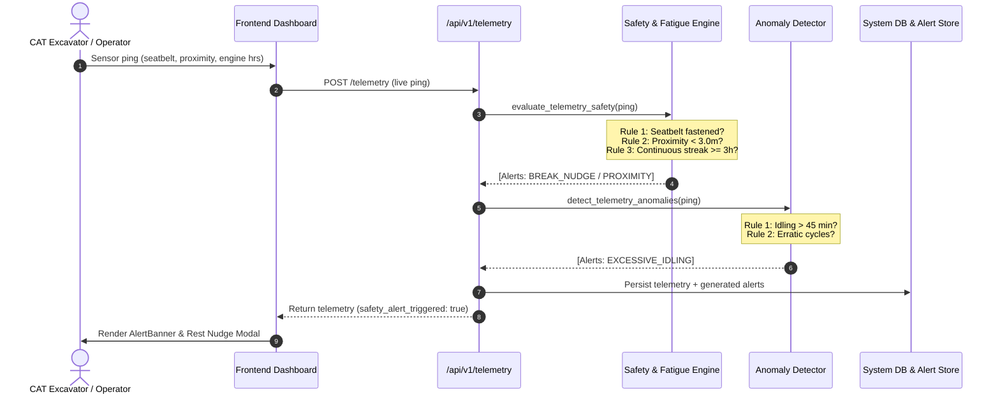
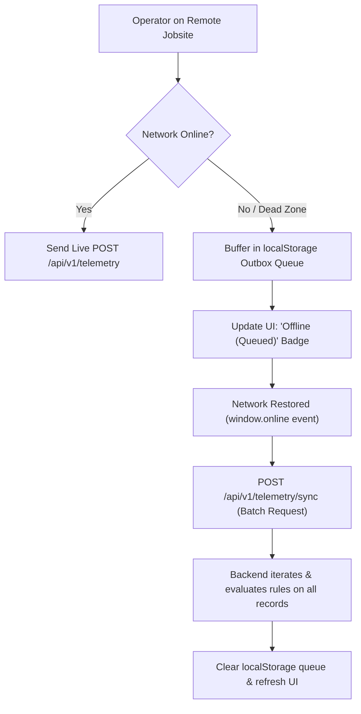
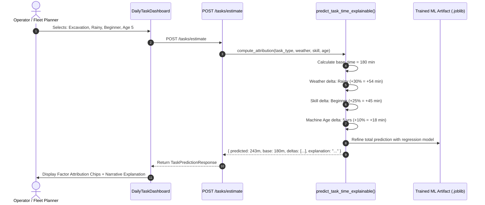
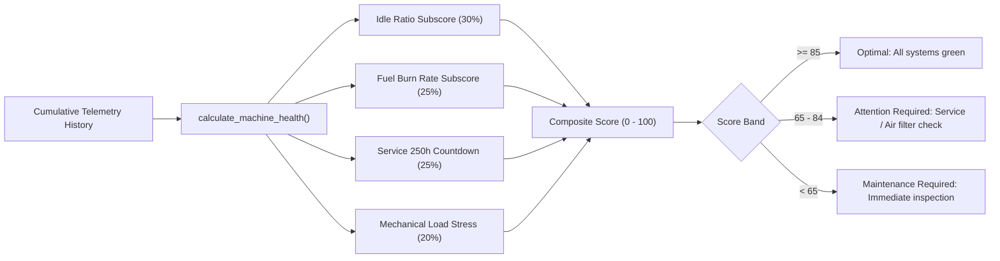

# API.md — Data Contracts, Schemas & Integration Specification

This document defines the complete API specification, data models, validation schemas, and end-to-end data movement flows for the **Smart Operator Assistant for CAT Machinery** monorepo.

---

## 1. Overview & Protocol Standards

- **Base URL (Local)**: `http://localhost:8000/api/v1`
- **Protocol**: HTTP/1.1 REST + JSON
- **CORS Policy**: Explicit origin allowlist with credentials (see `BACKEND_CORS_ORIGINS` in `.env.example`, defaults to `http://localhost:3000,http://localhost:5173`). Wildcard `*` is not used because it is incompatible with `allow_credentials=True` in browsers.
- **Interactive API Docs**:
  - Swagger UI: `http://localhost:8000/docs`
  - ReDoc: `http://localhost:8000/redoc`
  - OpenAPI JSON: `http://localhost:8000/api/v1/openapi.json`
- **Content-Type**: `application/json` for all request and response bodies.

---

## 2. Core Data Schemas & Types

All data payloads are strictly validated using Pydantic models in [backend/app/models/](file:///c:/projects/butterfree/backend/app/models/).

### 2.1 Enums

| Enum Name | Allowed Values | Description |
|---|---|---|
| `TaskType` | `Excavation`, `Trenching`, `Loading`, `Grading`, `Demolition` | Machinery operational tasks |
| `WeatherCondition` | `Sunny`, `Rainy`, `Cloudy`, `Windy` | Ambient site weather condition |
| `OperatorSkill` | `Beginner`, `Intermediate`, `Expert` | Experience profile of machine operator |
| `SeatbeltStatus` | `Fastened`, `Unfastened` | Cabin physical sensor state |
| `AlertSeverity` | `Low`, `Medium`, `High`, `Critical` | Triage level for safety events |
| `AlertType` | `Seatbelt Unfastened`, `Proximity Hazard`, `Excessive Idling`, `Unusual Usage Pattern`, `Fatigue & Drowsiness Warning`, `Operator Rest Break Nudge`, `Machine Health Degradation` | Category of logged incident/warning |
| `HealthRating` | `Optimal`, `Attention Required`, `Maintenance Required` | Predictive maintenance status |

---

### 2.2 Data Models

#### Task Model (`Task`)
Defined in [task.py](file:///c:/projects/butterfree/backend/app/models/task.py):

```typescript
interface Task {
  task_id: string;               // e.g. "TSK-1001"
  task_type: TaskType;           // "Excavation" | "Trenching" | ...
  weather: WeatherCondition;     // "Sunny" | "Rainy" | ...
  operator_skill: OperatorSkill; // "Beginner" | "Intermediate" | "Expert"
  machine_age_years: number;     // Integer >= 0, <= 30
  estimated_time_min: number;    // Planned duration in minutes
  actual_time_min?: number;      // Ground truth / completed duration (null if scheduled)
  status: string;                // "Scheduled" | "In Progress" | "Completed"
}
```

#### Telemetry Model (`Telemetry`)
Defined in [telemetry.py](file:///c:/projects/butterfree/backend/app/models/telemetry.py):

```typescript
interface Telemetry {
  timestamp: string;             // ISO 8601 UTC: "2026-09-23T08:00:00Z"
  machine_id: string;            // e.g. "CAT-EX-320"
  operator_id: string;           // e.g. "OP-401"
  engine_hours: number;          // Cumulative usage hours (float >= 0)
  fuel_used_liters: number;      // Fuel consumed (float >= 0)
  load_cycles: number;           // Completed load/bucket cycles (int >= 0)
  idling_time_min: number;       // Idle duration in minutes (int >= 0)
  continuous_run_hours: number;  // Hours worked without active rest break (float >= 0)
  seatbelt_status: SeatbeltStatus;// "Fastened" | "Unfastened"
  proximity_distance_m: number;  // Sensor distance to closest obstacle in meters
  safety_alert_triggered: boolean;// Auto-flagged if rules violated
}
```

#### Alert & Incident Model (`Alert`)
Defined in [alert.py](file:///c:/projects/butterfree/backend/app/models/alert.py):

```typescript
interface Alert {
  id: string;                    // e.g. "ALT-PRX-4a2b1c"
  alert_type: AlertType;         // Alert classification
  severity: AlertSeverity;       // "Low" | "Medium" | "High" | "Critical"
  machine_id: string;            // Machine emitting the telemetry
  operator_id: string;           // Operator currently logged in
  message: string;               // Descriptive human-readable message
  timestamp: string;             // ISO 8601 UTC
  acknowledged: boolean;         // True if operator or supervisor dismissed
}
```

#### Machine Health Score Model (`MachineHealthScore`)
Defined in [health.py](file:///c:/projects/butterfree/backend/app/models/health.py):

```typescript
interface MachineHealthScore {
  machine_id: string;            // e.g. "CAT-EX-320"
  score: number;                 // Composite score 0 - 100
  rating: HealthRating;          // "Optimal" | "Attention Required" | "Maintenance Required"
  idle_ratio_pct: number;        // Idling time percentage of engine hours
  fuel_burn_rate_lph: number;    // Fuel burn rate in Liters / hour
  service_hours_remaining: number;// Hours remaining until next 250h service milestone
  subscores: {
    idle_efficiency: number;     // 0 - 100 (30% weight)
    fuel_system: number;         // 0 - 100 (25% weight)
    service_schedule: number;    // 0 - 100 (25% weight)
    hydraulics: number;          // 0 - 100 (20% weight)
  };
  recommended_action: string;    // Actionable advisory for fleet maintenance
  evaluated_at: string;          // ISO 8601 UTC
}
```

---

## 3. Endpoints & Request/Response Contracts

### 3.1 Task Management & Explainable ML Estimation

#### `GET /tasks`
Retrieve all scheduled and historical tasks.
- **Request**: None
- **Response**: `200 OK` → `Array<Task>`
- **Example Response**:
```json
[
  {
    "task_id": "TSK-1001",
    "task_type": "Excavation",
    "weather": "Sunny",
    "operator_skill": "Expert",
    "machine_age_years": 3,
    "estimated_time_min": 180,
    "actual_time_min": 170,
    "status": "Completed"
  }
]
```

#### `POST /tasks`
Schedule a new operator task.
- **Request Body**:
```json
{
  "task_type": "Trenching",
  "weather": "Rainy",
  "operator_skill": "Intermediate",
  "machine_age_years": 5,
  "estimated_time_min": 145
}
```
- **Response**: `200 OK` → `Task` (returns created record with generated `task_id`).

#### `POST /tasks/estimate` (Explainable AI Duration Predictor)
Predict expected task duration with feature attribution breakdown.
- **Request Body**:
```json
{
  "task_type": "Excavation",
  "weather": "Rainy",
  "operator_skill": "Beginner",
  "machine_age_years": 5
}
```
- **Response**: `200 OK` → `TaskPredictionResponse`
```json
{
  "task_type": "Excavation",
  "predicted_time_min": 243.0,
  "base_time_min": 180,
  "weather_delta_min": 54.0,
  "skill_delta_min": 45.0,
  "age_delta_min": 18.0,
  "explanation": "Estimated 243.0 min — Base 180 min (+54.0m due to Rainy weather, +45.0m due to Beginner skill, +18.0m for machine age 5 yrs)",
  "feature_impacts": {
    "base": 180.0,
    "weather": 54.0,
    "skill": 45.0,
    "machine_age": 18.0
  }
}
```

---

### 3.2 Telemetry & Offline Batch Synchronization

#### `GET /telemetry`
Retrieve the last 50 recorded machine telemetry pings.
- **Request**: None
- **Response**: `200 OK` → `Array<Telemetry>`

#### `POST /telemetry` (Live Telemetry Ingestion)
Ingest a real-time telemetry ping. Triggers real-time safety evaluation, fatigue inference, and anomaly checks.
- **Request Body**:
```json
{
  "machine_id": "CAT-EX-320",
  "operator_id": "OP-401",
  "engine_hours": 1253.0,
  "fuel_used_liters": 24.5,
  "load_cycles": 16,
  "idling_time_min": 14,
  "continuous_run_hours": 3.4,
  "seatbelt_status": "Fastened",
  "proximity_distance_m": 2.4
}
```
- **Response**: `200 OK` → `Telemetry`
  *(Note: `safety_alert_triggered` is automatically set to `true` if proximity < 3m, seatbelt unfastened, or continuous hours >= 3h).*

#### `POST /telemetry/sync` (Offline-First Batch Ingestion)
Flushes an array of telemetry readings buffered locally by the frontend while offline.
- **Request Body**:
```json
{
  "client_id": "frontend-offline-client",
  "records": [
    {
      "timestamp": "2026-09-23T11:00:00Z",
      "machine_id": "CAT-EX-320",
      "operator_id": "OP-401",
      "engine_hours": 1254.0,
      "fuel_used_liters": 28.0,
      "load_cycles": 18,
      "idling_time_min": 15,
      "continuous_run_hours": 3.8,
      "seatbelt_status": "Fastened",
      "proximity_distance_m": 6.5
    }
  ]
}
```
- **Response**: `200 OK` → `TelemetryBatchSyncResponse`
```json
{
  "status": "success",
  "synced_records_count": 1,
  "alerts_triggered_count": 1,
  "message": "Successfully synced 1 offline records with 1 safety events logged."
}
```

---

### 3.3 Safety, Alerts & Incident Management

#### `GET /alerts`
Retrieve all safety alerts and logged anomalies.
- **Response**: `200 OK` → `Array<Alert>`

#### `GET /alerts/active`
Retrieve unacknowledged safety alerts requiring immediate operator or supervisor action.
- **Response**: `200 OK` → `Array<Alert>`

#### `POST /alerts/{alert_id}/acknowledge`
Acknowledge an active alert or dismiss a fatigue rest nudge.
- **Parameters**: `alert_id` (Path, string)
- **Response**: `200 OK` → `Alert` (`acknowledged: true`)

---

### 3.4 Digital Twin & Machine Health Diagnostics

#### `GET /health-score/{machine_id}`
Calculate and retrieve the dynamic Machine Health Score and predictive maintenance advisory for a machine.
- **Parameters**: `machine_id` (Path, string, e.g. `CAT-EX-320`)
- **Response**: `200 OK` → `MachineHealthScore`
```json
{
  "machine_id": "CAT-EX-320",
  "score": 91,
  "rating": "Optimal",
  "idle_ratio_pct": 11.2,
  "fuel_burn_rate_lph": 15.4,
  "service_hours_remaining": 124.0,
  "subscores": {
    "idle_efficiency": 100,
    "fuel_system": 100,
    "service_schedule": 100,
    "hydraulics": 95
  },
  "recommended_action": "All systems green. Normal preventative inspection scheduled.",
  "evaluated_at": "2026-09-23T15:00:00Z"
}
```

#### `GET /health-score`
Retrieve current health scores for all tracked machinery in the fleet.
- **Response**: `200 OK` → `Array<MachineHealthScore>`

---

### 3.5 Operator Training Hub

#### `GET /training/modules`
Retrieve operator training catalog and simulation modules.
- **Response**: `200 OK` → `Array<TrainingModule>`
```json
[
  {
    "id": "TRN-01",
    "title": "Excavator Trenching & Safety Protocol",
    "category": "Safety",
    "duration_min": 25,
    "difficulty": "Beginner",
    "completed": false
  }
]
```

---

## 4. End-to-End Data Movement & Lifecycle Flows

### 4.1 Live Telemetry Ingestion & Safety Dispatch



---

### 4.2 Offline-First Resilience & Batch Syncing



---

### 4.3 Explainable Task Estimation Flow



---

### 4.4 Digital Twin / Predictive Maintenance Lifecycle



---

## 5. HTTP Status Codes & Error Handling

Standard HTTP response codes:
- `200 OK`: Request succeeded.
- `400 Bad Request`: Malformed payload or invalid query parameters.
- `404 Not Found`: Task or Alert ID not found.
- `422 Unprocessable Entity`: Pydantic validation failure (e.g. invalid enum value, out-of-range machine age).

### Error Payload Format
```json
{
  "detail": [
    {
      "loc": ["body", "machine_age_years"],
      "msg": "Input should be less than or equal to 30",
      "type": "less_than_equal"
    }
  ]
}
```

---

## 6. Client Integration Code Snippets

### JavaScript / Fetch Example
```javascript
// Estimate task with Explainable AI breakdown
async function getEstimate(taskData) {
  const res = await fetch("http://localhost:8000/api/v1/tasks/estimate", {
    method: "POST",
    headers: { "Content-Type": "application/json" },
    body: JSON.stringify(taskData),
  });
  const data = await res.json();
  console.log("Prediction:", data.predicted_time_min, "Explanation:", data.explanation);
  return data;
}

// Ingest machine telemetry
async function logTelemetry(ping) {
  const res = await fetch("http://localhost:8000/api/v1/telemetry", {
    method: "POST",
    headers: { "Content-Type": "application/json" },
    body: JSON.stringify(ping),
  });
  return res.json();
}
```

### Python / Requests Example
```python
import requests

BASE_URL = "http://localhost:8000/api/v1"

# Query Machine Health Score
resp = requests.get(f"{BASE_URL}/health-score/CAT-EX-320")
health = resp.json()
print(f"Health Score: {health['score']} | Status: {health['rating']}")
print(f"Action: {health['recommended_action']}")
```

